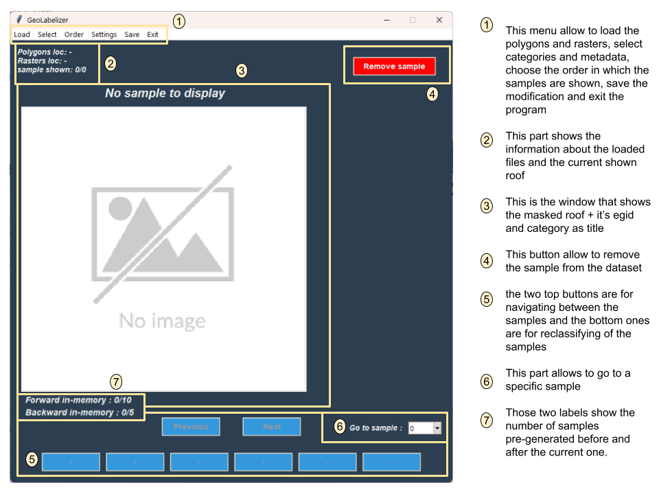
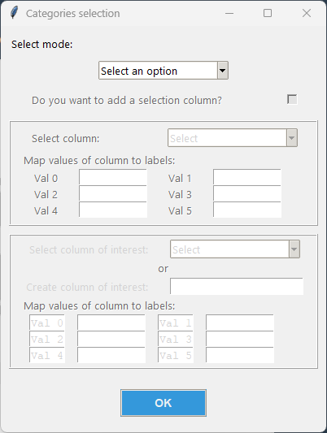
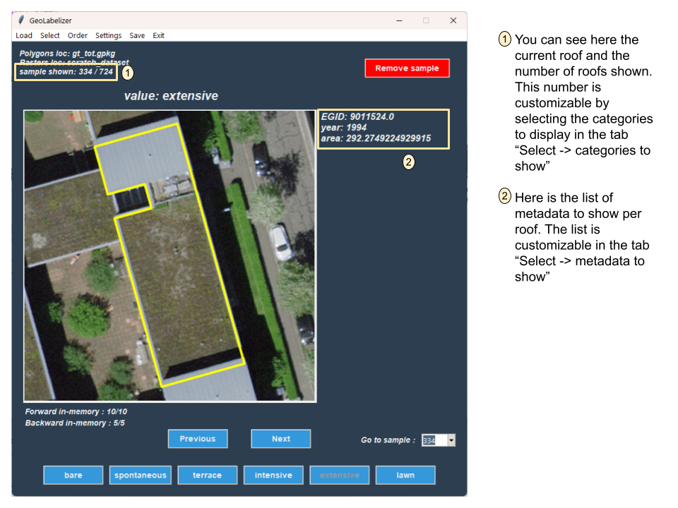
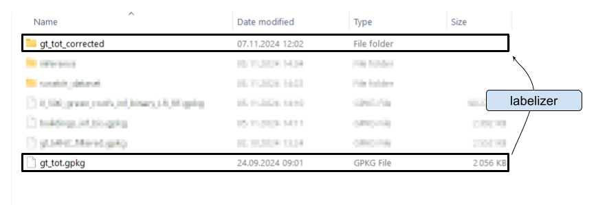
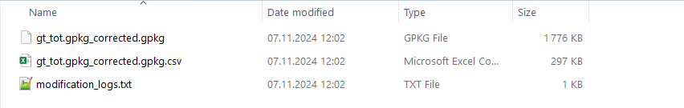

# GeoLabelizer 
This project consist in the developpement of a software to help with the visualization and manual labelization/correction of samples based on a set of rasters and a corresponding set of polygons.

It can achieve two different tasks:
- the labelization of a dataset. This mode consists in labelizing from scratch a set of polygons.
- the correction of a dataset. This mode allows to change the value of the predicted class for each sample.

## Initialization
**Warning: This project was developped on Windows and instances cloned on Linux system have shown difficulties to install some libraries. If possible, it is recommended to install it on a version 3.9 of Python on Windows 11.**

There is two ways of setting the environnement up from the root of the project:
- Pip:
  1) Creation of the environement: `python -m venv .venv`
  2) Connect to it:
      - on Windows: `.\.venv\Scripts\activate`
      - on Linux: `source .venv/bin/activate`
  4) Import the libraries through the requirements.txt file: `pip install -r requirements.txt`
- Conda:
  1) Simply run the following command: `conda env create -f environment.yml`
  2) Connect to it: `conda activate geo-labelizer`
      
## Tutorial
Here is a step-by-step procedure to labelize or correct your first dataset:

1) When launching the software by running `main.py`, the following window will appear.

    

2)  The first step is to load rasters and polygons from the menu `load`. When loading the polygons, the following form will appear. There, you are asked to choose the mode between the two following options:
  - Labelizer: This mode is used to add a column to the dataset with the categories of your choice. You have the possibility to use a _selection column_ by clicking on the corresponding checkbox. If so, you will need to select between the existing columns and then assign a display value for each different values in this column. The app will not allow a column with more than 6 different values. You will then need to enter the name of the new column under _Create column of interest_ and give each value (which is going to be saved inside the resulting file), as well as the corresponding display value. Here also, you can not create more than 6 different values.
  - Correcter: This mode aims at correcting an existing column of the dataset. You will need to select which one under _Select column of interest_ and then provide a display value for each different value of the column. The app will also not allow to choose a column with more than 6 different values.

    

3) Once the poylgon file and the raster location are given, you will now be able to start working on the dataset:

    

4) When the job is done, or if you want to save your work in progress, you can press the `save` tab. By doing so, a folder will be created in the same location as your polygon file with the same name + the suffix `-corrected`.

    

5) Inside this folder, you will find 3 files:
   -  the new version of the polygon file. 
      - In **correcter** mode, it will be a copy with the modifications.
      - In **labelizer** mode, only the modified samples will be saved in this file
   - a .csv version of the new polygon file for ease of verification purpose
   - a .txt file with the log of all the modification that have been made.

    

6) Shortkeys:
   - In order to make the usage of the application more ergonomical, the following actions were mapped to the following keys:
      - Move forward: Right arrow, Key 'D', Spacebar
      - Move backward: Left arrow, key 'A'
      - Save project: Ctrl + S

