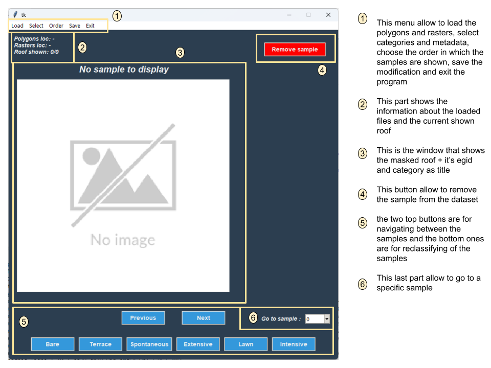
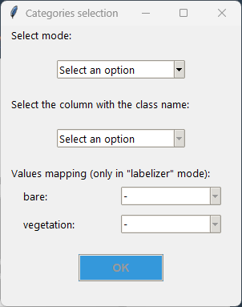
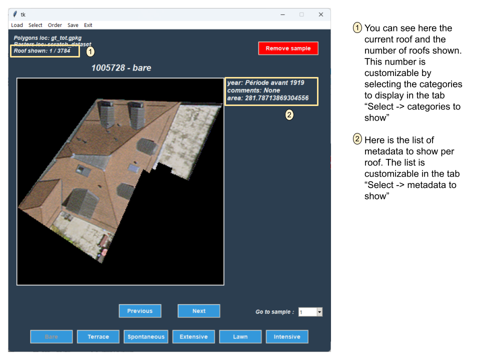
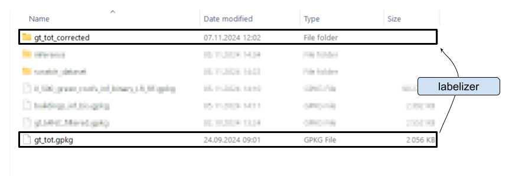
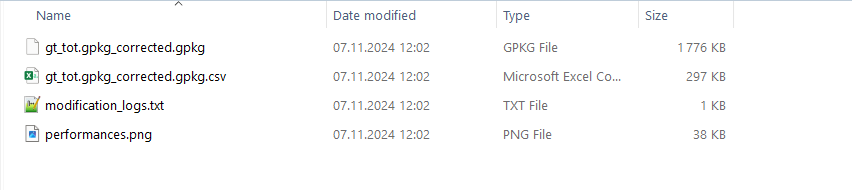

# GeoLabelizer
This project consist in the developpement of a small software to help with the visualization and manual modification of samples with the [vegroof-project](https://github.com/swiss-territorial-data-lab/proj_vegroofs_DL).

It can achieve two different tasks:
- the labelization of a dataset. This mode consist in labelizing from scratch a set of polygons.
- the correction of a dataset. This mode allows to change the value of the predicted class for each sample.

## Initialization
There is two ways of setting the environnement up from the root of the project:
    - Pip:
      1) Creation of the environement: `python -m venv .venv `
      2) Importing the libraries through the requirements.txt file: `pip install -r requirements.txt`
    - Conda:
      1) Simply run the following command: `conda env create -f environment.yml`
      
## Tutorial
Here is a small step-by-step to labelize or correct your first dataset:

1) When launching the software, the following window will appear.

    

2) The first step is going to be to load rasters and polygons from the tab `load`. When loading the polygons, the following form will appear. There, you are asked to choose the mode between the two following options:
  - Labelizer: this mode is planned for processing binary predictions (or non-categorized files) and choosing a category for each sample. When selecting this mode, you will be asked to choose a `class name` that correspond to the binary categorization. Once this class name is chosen, you will be ask to map the corresponding values for `bare` and `vegetated` in the "Values mapping" section before being able to click on `OK`.
  - Correcter: this mode is to correct the prediction of a multi-class classification model. You will be asked to choose a `class name` but the last part will stay disabled and you will be able to directly click on the `OK button`

    

3) Once the poylgon file and the raster location are given, you will now be able to start working on the dataset:

    

4) When the job is done, or if you want to save your work in progress, you can press the `save` tab. By doint so, a folder will be created in the same location as your polygon file with the same name + the suffix `-corrected`.

    

5) Inside this folder, you will find 3 or 4 files:
   -  the new version of the polygon file. 
     - In **correcter** mode, it will be a copy with the modifications.
     - In **labelizer** mode, only the modified samples will be saved in this file
   - a .csv version of the new polygon file for ease of verification purpose
   - a .txt file with the lof of all  the modification that have been made.
   - Only in **correcter** mode; an image with the computed performances of the original file with respect to the corrections made.

    

